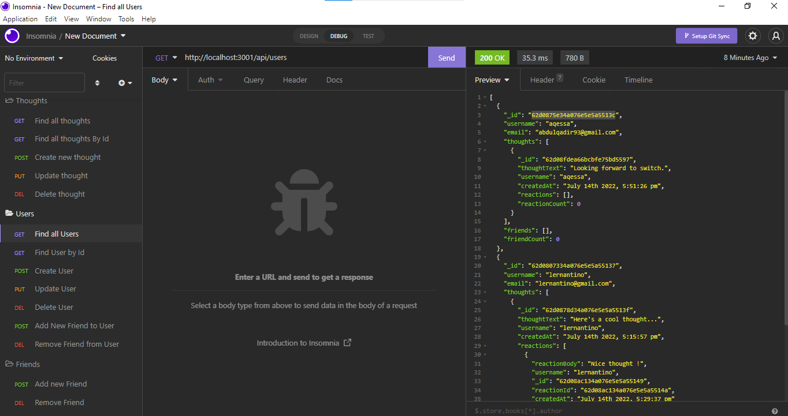
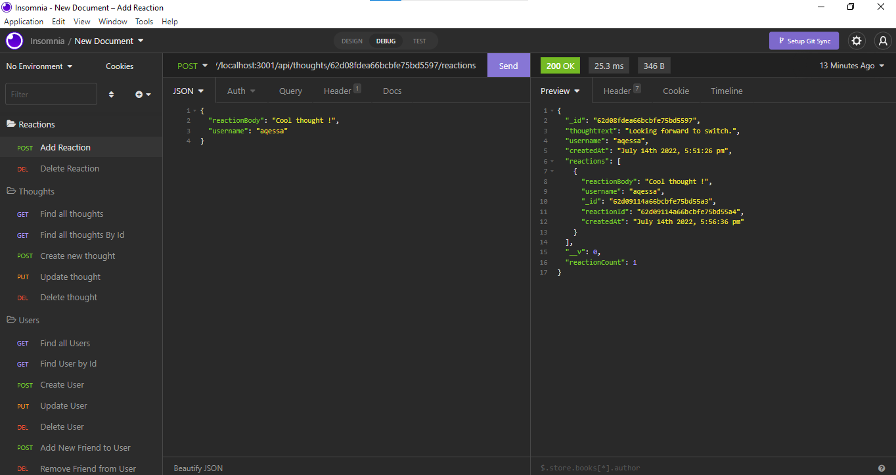

# socialLinking

I am a start-up that wants to use a NoSQL database to power my social network API. To handle large amounts of unstructured data on my website

In the case of a social network API, WHEN I invoke the application, my server will start and the Mongoose models will be synced with the MongoDB database. In Insomnia, when I open API GET routes for users and thoughts, the data is displayed in a formatted JSON. Using Insomnia, I can successfully create, update, and delete users and thoughts in my database when I test API POST, PUT, and DELETE routes. I can successfully create and delete reactions to thoughts and add and remove friends to a user's friend list when I test API POST and DELETE routes in insomnia.

## Video walkthrough links
Part 1(Users and Thoughts) https://www.loom.com/share/104ed60487804100b2ed635fa0a1583a
Part 2(Reactions and Friends) https://www.loom.com/share/91d3437c5f0847319ecc2619b187df80

## Screenshots
 
 
